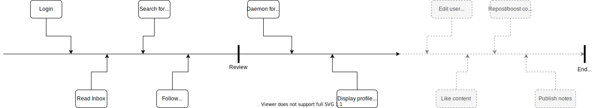

 

# Documentation
In this repository we collect project wide documentation and issue tracking.

## Meetings
* [29.02.2020](./documents/minutes/2020-02-29.md)
* [02.04.2020](./documents/minutes/2020-04-02.md)
* [17.04.2020](./documents/minutes/2020-04-17.md)

## Project timeline

## Documents

* [Brainstorming](./documents/brainstorming.md)
* [Wireframes](./wireframes/wireframes.md)

### Backend

#### Class diagram

