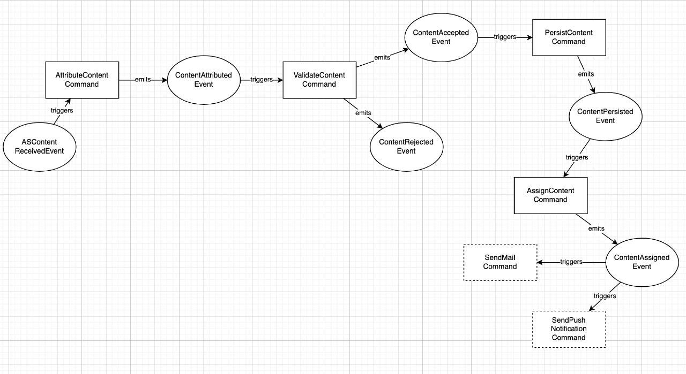
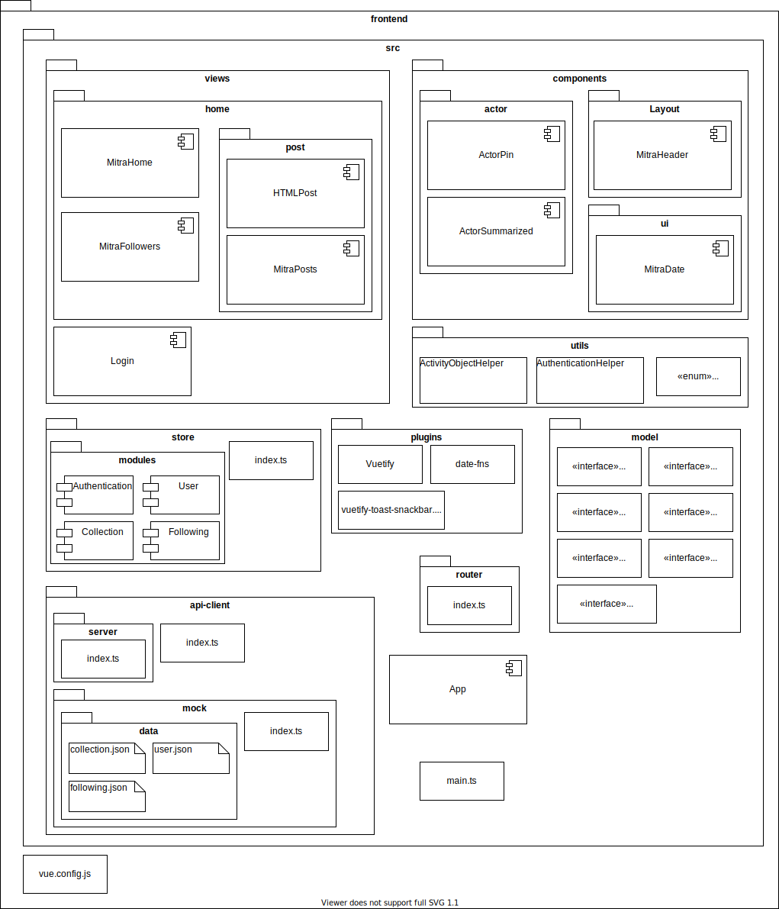

# Architecture & Design

## Backend

### Block view level 1

- **API:** The API reflects the service with its endpoints as described in the ActivityPub standard (for example: inbox/outbox/user endpoints) plus some additional endpoints not discussed in ActivityPub standard document but necessary for the proper functioning of the application (for example: register/token issue endpoint). In general the API component MUST be implemented non-blocking in regard of calls to remote servers. Thus all calls to remote servers MUST be reflected by tasks pushed into the _**Queue**_ and handled asynchronously. This guarantees fast response times for the API. Although there MAY be some exceptions like pulling a remote user's outbox explicitly by a call to a dedicated endpoint for this.
- **Worker:** The worker processes the tasks in the _**Queue**_ and executes all the calls to external servers to push or pull information requested in the currently processed task. The worker MAY push follow up tasks into the _**Queue**_.
- **Queue:** The queue holds all the open tasks that need to be processed by the _**Worker**_ component.
- **DB:** The database component in general stores all the information generated on the server through either the _**API**_ or _**Worker**_ as well as external fetched content through the _**Worker**_ component.
- **File system:** All media data like images, videos, etc. either produced through API calls or through calls to remote servers by the _**Worker**_ is stored in the file system and references to the location are stored in the _**DB**_.

### Class diagram

### Activity Diagramm
#### Message bus - write into inbox

Description coming soon

## Frontend

### Class diagramm

#### Block view level 1

- \**Router*3 — All the routes of your projects (in my case I have them in the index.js). Basically in Vue.js everything is a component. But not everything is a page. A page has a route like “/dashboard”, “/settings” or “/search”. If a component has a route it is routed.
- **Components** — All the components of the projects that are not the main views
- **Views** — To make the project faster to read I separate the components that are routed and put them in this folder. The components that are routed for me are more than a component since they represent pages and they have routes, I put them in “views” then when you check a page you go to this folder.
- **Store** — The Vuex constants in mutation-type.js, the Vuex modules in the subfolder modules (which are then loaded in the index.js).
- **API-Client** — API client is a service for calling up data. An http request is sent to the backend server or directly to the fediverse. It is also possible to configure a mock server.

#### Block view level 2

description coming soon

### Process description

#### Block view level 1 - Get posts

**Login**

- 1.0 The user logged in.
- 1.1 The frontend gets the latest posts from the backend and prepares it for viewing.
- 1.2 The user can view the posts.

**Scroll**

- 2.0 The user scrolls down.
- 2.1 The frontend gets the next newest posts.
- 2.2 The user can view the posts.

**Pulling posts**

- 3.0 After a defined time, the latest post is triggered in the frontend.
- 3.1 The frontend gets the latest posts from the backend and prepares it for viewing.
- 3.2 The user can view the posts.

### Block view level 2 - Get posts: Login

- 1.0 The user logs in with his credential on the login page.

- 2.0 The router directs the user to his home page with the posts.

- 3.0 The components let the lifecycle created run.
- 3.1 In the created function, the `fetchCollectio()` is called from the _CollectionStore_.
- 3.2 `getPost()` is triggered as soon as the items in the _collectionStore_ are updated.

- 4.0 The _collectionStore_ calls the _apiServer_ to receive the collection data.
- 4.1 If the data comes back from the _apiServer_, the collection data is saved in the _collectionStore_
- 4.2 If a collection item is a create, it is checked whether the object is one of the post types and pulls the post out and adds it to the list of posts.
- 4.3 If a collection item is an update, it is checked whether the object is one of the post types and pulls the post out and adds it to the list of posts and deletes the old post from the list.
- 4.4 If a collection item is a delete, the ID is read out and filtered out of the post list.

- 5.0 Backend get request of the inbox of the user of the latest posts.

### Activity Diagramm

#### Pull out actor's add name

##### Version 1

- 1.0 The Actor Property (`actor` or `attributedTo`) is extracted from the activity object and passed to a Util method that extracts the display from the object.
- 2.0 It is checked whether the object has the property _name_ and is not empty. If not go to the next condition.
  - 2.1 The content is returned from the object by the property _name_.
- 3.0 It is checked whether the object has the property _namemap_ and is not empty. If not go to the next condition.
  - 3.1 The language is currently fetched from the browser. Later, multilanguage should be possible and the language should be taken from there.
  - 3.2 With the language input, the corresponding name is extracted from the object. If the language does not exist, the first value in the _namemap_ object is taken ([must still be fixed on issue 36](https://github.com/mitra-social/mitra-frontend/issues/36)).
- 4.0 It is checked whether the object has the property _preferredUsername_ and is not empty. If not go to the next condition.
  - 4.1 The content is returned from the object by the property _preferredUsername_.
- 5.0 It is checked whether the object is a URL (string). If not, default undefined is returned.
  - 5.1 First it is checked whether the URL has already been called to prevent an infinity loop. If this has already been the case and is still a url, undefined will be returned.
  - 5.2 With the URL, a call is made to the Fediverse to get the actor information. Then the method for extracting the name is run through again and marked that the method had already been run through.
- 6.0 If none of the conditions apply, undefined will be returned.
- 7.0 Finally, the name is displayed in the component.

##### Version 2

- 1.0 The actor property(`actor` or `attributedTo`) is read from the activity object's response from the backend.
- 2.0 It will be checked if it is a url. If it is not, continue with 5.0.
- 3.0 A call is made to the Fediverse with the URL in order to receive information about the actor.
- 4.0 The actor property es activity object is overwritten with the information from the fediverse.
- 5.0 The status of the data from the store is updated with the data from the response from the backend.
- 6.0 The affected components update the data from the store and thus the display of the name has to be updated again with the method of Util to extract the display name.

- 7.0 It is checked whether the object has the property _name_ and is not empty. If not go to the next condition.
  - 7.1 The content is returned from the object by the property _name_.
- 8.0 It is checked whether the object has the property _namemap_ and is not empty. If not go to the next condition.
  - 8.1 The language is currently fetched from the browser. Later, multilanguage should be possible and the language should be taken from there.
  - 8.2 With the language input, the corresponding name is extracted from the object. If the language does not exist, the first value in the _namemap_ object is taken ([must still be fixed on issue 36](https://github.com/mitra-social/mitra-frontend/issues/36)).
- 9.0 It is checked whether the object has the property _preferredUsername_ and is not empty. If not go to the next condition.
  - 9.1 The content is returned from the object by the property _preferredUsername_.
- 10.0 It is checked whether the object has the property _id_ and is not empty. If not go to the next condition.
  - 10.1 The content is returned from the object by the property _id_.
- 11.0 It is checked whether the object is a URL (string). If not go to the next condition.
  - 11.1 The URL will be returned
- 12.0 If none of the conditions apply, undefined will be returned.
- 13.0 Finally, the name is displayed in the component.

##### Decision

The first version had the disadvantage that request call was in the util method and the _dump_ components have additional tasks because of the asynchronous call.
In the second version, the various data are put together correctly in the store and therefore the Utils does not have an additional asynchrony and the _dump_ components do not need any additional logic.
