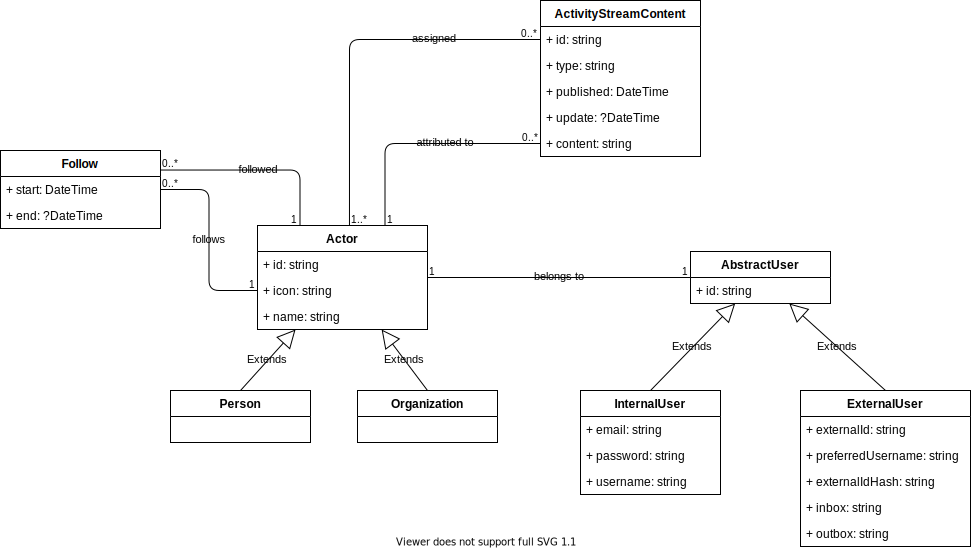

# Architecture & Design

## Backend

### Block view level 1

* **API:** The API reflects the service with its endpoints as described in the ActivityPub standard (for example: inbox/outbox/user endpoints) plus some additional endpoints not discussed in ActivityPub standard document but necessary for the proper functioning of the application (for example: register/token issue endpoint). In general the API component MUST be implemented non-blocking in regard of calls to remote servers. Thus all calls to remote servers MUST be reflected by tasks pushed into the _**Queue**_ and handled asynchronously. This guarantees fast response times for the API. Although there MAY be some exceptions like pulling a remote user's outbox explicitly by a call to a dedicated endpoint for this.
* **Worker:** The worker processes the tasks in the _**Queue**_ and executes all the calls to external servers to push or pull information requested in the currently processed task. The worker MAY push follow up tasks into the _**Queue**_.
* **Queue:** The queue holds all the open tasks that need to be processed by the _**Worker**_ component.
* **DB:** The database component in general stores all the information generated on the server through either the _**API**_ or _**Worker**_ as well as external fetched content through the _**Worker**_ component.
* **File system:** All media data like images, videos, etc. either produced through API calls or through calls to remote servers by the _**Worker**_ is stored in the file system and references to the location are stored in the _**DB**_.

### Class diagram

## Frontend

### Block view level 1

- `Router` — All the routes of your projects (in my case I have them in the index.js). Basically in Vue.js everything is a component. But not everything is a page. A page has a route like “/dashboard”, “/settings” or “/search”. If a component has a route it is routed.
- `Components` — All the components of the projects that are not the main views
- `Views` — To make the project faster to read I separate the components that are routed and put them in this folder. The components that are routed for me are more than a component since they represent pages and they have routes, I put them in “views” then when you check a page you go to this folder.
- `Store` — The Vuex constants in mutation-type.js, the Vuex modules in the subfolder modules (which are then loaded in the index.js).
- `API-Client` — API client is a service for calling up data. An http request is sent to the backend server or directly to the fediverse. It is also possible to configure a mock server.

