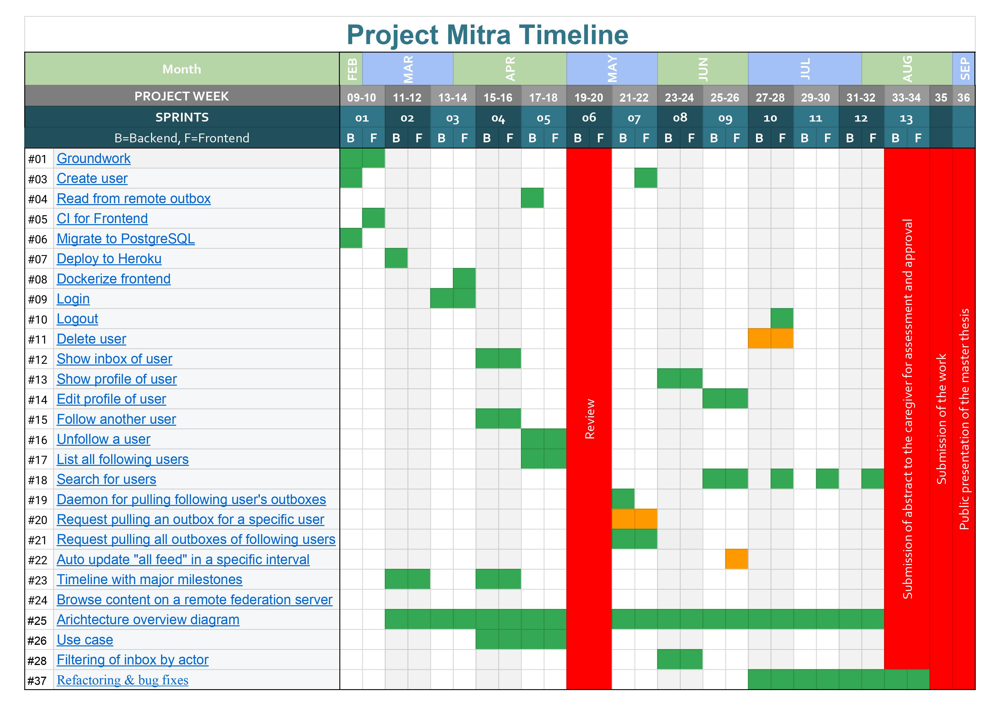

# Project Mitra

## Project period

| Project start | End of project |
| ------------- | -------------- |
| 2019-09-26    | 2020-08-28     |

## Project goals

Software is to be developed which enables the following goals and functions:

- You want to be able to register and then log in with your user.
- User should receive posts from other users who are followed.
- Contemporary and simple design.
- Easy handling.

## Justification, benefits

- Many implementations of the Standard ActivityPub are clones from well-known social media, you want to get the best stuff of them all.
- Reduce the limitations of how to implement activity pub.

## Non-goals

- Additional functions should be implemented after the master's thesis, as there is not enough time for a comprehensive implementation of the ActivityPub standard.

## Criteria for the successful end of the project

- A working installation where a logged in user can see posts.
- Documentation complete.

## Necessary core project team

- Software Engineer
- PHP Developer
- Javascript Developer

## Risk analysis

### Risks

#### Project

- **RP-01** Unknown protocol ActivityPub - No project member has ever worked with this protocol so the risk is that it takes us a long time to successfully manage it or don't manage to get it working at all.
- **RP-02** Scope - The project of building a social network server based upon the ActivityPub standard is a huge endeavor therefor the risk is given that the scope is not defined well or even not defined at all.

#### Application

- **RA-01** Slow third parties - Due to the decentralized approach of the project there is the possbility that remote servers are responding very slow or not at all.
- **RA-02** None-standard conform third parties - Due to the decentralized approach of the project and various implementations of the protocol on different servers there is the possibility that server instances not always behave the same and don't implement the ActivityPub standard properly which could lead to bugs and missing information in our application.

| Risk No. | Impact   | Likelihood |
| -------- | -------- | ---------- |
| RP-01    | **high** | _small_    |
| RP-02    | medium   | medium     |
| RA-01    | **high** | **high**   |
| RA-02    | _small_  | **high**   |

### Measures

#### Project

- **MP-01** Plan enough time and resources in the beginning to understand the standard well and do some prototypes/proof of concepts.
- **MP-02** Clearly define the scope (see for example the use-cases we want to cover within this project)

#### Application

- **MA-01** Calls to third parties should be made asynchronously to prevent slow response times on our implementation.
- **MA-02** The ActivityPub standard implementation on our side should be as complete as possible for the implemented use-cases so we can cover all variations of requests/responses. We need to check the major other ActicityPub projects and test if they behave according to the standard and if not maybe implement some fallbacks by compromising the proper implementation of the standard on our side as less as possible. Additionally make sure that non-conform server instances don't break out application.

## Milestones

- **green:** done
- **blue:** open
- **orange:** not implemented

## Meetings

- [05.03.2020](./minutes/2020-03-05.md)
- [02.04.2020](./minutes/2020-04-02.md)
- [17.04.2020](./minutes/2020-04-17.md)

## Project completion

### What has been achieved
At the end of the project it was achieved that an application where you can follow other users, read posts and filter posts by user. The design is simple and should be easy to use.

It looks like this in detail:
- ActivityPub standard complied with.
- A user can register and log in. Logging out works on the front end.
- The user can change their email and password in their settings
- Follow and no longer follow from other users was the only write access. The idea behind it was, to get mail you first have to follow the user who write the mail.
- The posts are fetched in the backend at a certain interval and the corresponding distribution to the users who leave the posts. In addition, with reply post, the post was displayed to the replied.
- Images can be displayed as thumbnail in post and displayed in full size in a dialog.
- The post can be filtered by a user. When paging the post, the filter is retained until the filter is deactivated.
- Searching for users with the web finger id works. Some information about the searched user is also displayed.

### What was not achieved
Use cases with low priority have been postponed. 

It looks like this in detail:
- Automatic update of the post from the frontend. Is low priority.
- Deleting our is not yet implemented. Is low priority.
- Forgot password has not yet been implemented. Is low priority.
- Retrieving an outbox of a specific user was considered obsolete and will not be implemented.

### Conclusion

The application can be used as a post feed. Users can be searched for or filtered. The user can make a minimum of adjustments to his profile.

The challenge was to understand and implement the ActivityPub standard.
The ActivityPub standard was not implemented so carefully by other servers and presented us with certain problems. Specific adjustments to other implementations must be made at a later point in time.

The stabilization of the backend side more time than expected. Since also brought more and more content problems to light. This was largely remedied.

In the front end, the time waster was the tests unit. because the know-how was not on a high level. Nevertheless, a test coverage of over 95% was achieved. And in the end it was an instructive part.

In the course of the development it became clear that it makes sense to be able to follow other users as many variants as possible. how to search via webfinger id.

The highlight was when the application could communicate with other servers for the first time and other users could display them.

The structure of the backend and frontend was checked, so that the write access can easily be incorporated at a later point in time and a switch to messaging is possible.
