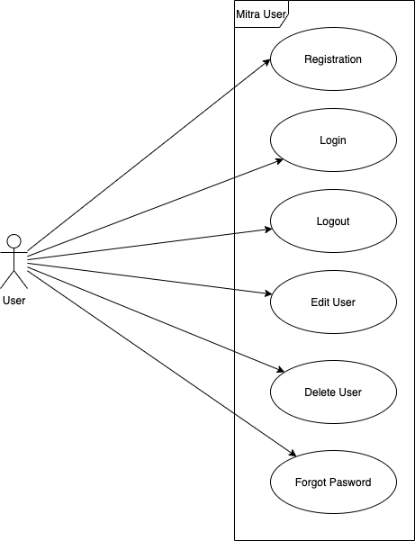

# Functional requirements

## Use Case

### Template

| Section             | Content |
| ------------------- | ------- |
| Identifier          | -       |
| Name                | -       |
| Author              | -       |
| Priorität           | -       |
| Priority            | -       |
| Criticality         | -       |
| Origin              | -       |
| Responsibility      | -       |
| Description         | -       |
| Triggering Event    | -       |
| Actor               | -       |
| Precondition        | -       |
| Postcondition       | -       |
| Exception scenarios | -       |
| Quality             | -       |

### User Case

Section | Content
------------------------| -------------
Identifier | UC-01
Name | Registry
Author | Pascal, Franco
Priority | High importance for system success. Technological risk low
Criticality | High
Responsibility | Pascal, Franco
Description | The user registers on the Mitra site with his email, preferred username and password.
Triggering Event | Click on the registration button.
Actor | User
Precondition | Email or preferred username is not registered.
Exception scenarios | Email or preferred username already exists. The repeating password does not match.
Quality |

| Section             | Content                                                                          |
| ------------------- | -------------------------------------------------------------------------------- |
| Identifier          | UC-02                                                                            |
| Name                | Login                                                                            |
| Author              | Pascal, Franco                                                                   |
| Priority            | High importance for system success. Technological risk low                       |
| Criticality         | High                                                                             |
| Responsibility      | Pascal, Franco                                                                   |
| Description         | The user sign in with his preferred username and password on the login of mitra. |
| Triggering Event    | User calls up the mitra page and lands on the login page.                        |
| Actor               | User                                                                             |
| Precondition        | User has registered and knows his credential.                                    |
| Exception scenarios | Credential is not correct.                                                       |
| Quality             |

| Section          | Content                                                    |
| ---------------- | ---------------------------------------------------------- |
| Identifier       | UC-03                                                      |
| Name             | Logout                                                     |
| Author           | Pascal, Franco                                             |
| Priority         | High importance for system success. Technological risk low |
| Criticality      | High                                                       |
| Responsibility   | Pascal, Franco                                             |
| Description      | The user logged out of the Mitra page.                     |
| Triggering Event | Click on the logout button.                                |
| Actor            | User                                                       |
| Precondition     | The user is logged in.                                     |
| Quality          |

| Section             | Content                                                         |
| ------------------- | --------------------------------------------------------------- |
| Identifier          | UC-04                                                           |
| Name                | Edit User                                                       |
| Author              | Pascal, Franco                                                  |
| Priority            | Middle importance for system success. Technological risk middle |
| Criticality         | Middle                                                          |
| Responsibility      | Pascal, Franco                                                  |
| Description         | The user can edit his personal data or his password.            |
| Triggering Event    | User calls up the mitra page and lands on the login page.       |
| Actor               | User                                                            |
| Postcondition       | Token is correct.                                               |
| Exception scenarios | The repeating password does not match.                          |
| Quality             |

| Section             | Content                                                         |
| ------------------- | --------------------------------------------------------------- |
| Identifier          | UC-05                                                           |
| Name                | Delete User                                                     |
| Author              | Pascal, Franco                                                  |
| Priority            | Middle importance for system success. Technological risk middle |
| Criticality         | Middle                                                          |
| Responsibility      | Pascal, Franco                                                  |
| Description         | The user can delete his account.                                |
| Triggering Event    | Click the Delete button.                                        |
| Actor               | User                                                            |
| Precondition        | The user must confirms that the account will be deleted.        |
| Postcondition       | Token is correct.                                               |
| Exception scenarios | The repeating password does not match.                          |
| Quality             |

### Posts Case

Section | Content
------------------------| -------------
Identifier | UC-06
Name | Show posts
Author | Pascal, Franco
Priority | High importance for system success. Technological risk high
Criticality | High
Responsibility | Pascal, Franco
Description | The post is displayed to the user from the user he is following.
Triggering Event | The login redirects to the home with the posts, the home link is clicked or system pulling with a intervall.
Actor | User
Precondition | The user is login.
Postcondition | Token is correct.
Quality |

| Section          | Content                                                                  |
| ---------------- | ------------------------------------------------------------------------ |
| Identifier       | UC-07                                                                    |
| Name             | Create post                                                              |
| Author           | Pascal, Franco                                                           |
| Priority         | Middle importance for system success. Technological risk high            |
| Criticality      | Low                                                                      |
| Responsibility   | Pascal, Franco                                                           |
| Description      | The user selects the type of post and then fills in the desired content. |
| Triggering Event | User clicks create post.                                                 |
| Actor            | User                                                                     |
| Precondition     | The user is login.                                                       |
| Postcondition    | Token is correct.                                                        |
| Quality          |

| Section          | Content                                                       |
| ---------------- | ------------------------------------------------------------- |
| Identifier       | UC-08                                                         |
| Name             | Edit post                                                     |
| Author           | Pascal, Franco                                                |
| Priority         | Middle importance for system success. Technological risk high |
| Criticality      | Low                                                           |
| Responsibility   | Pascal, Franco                                                |
| Description      | The user can edit a desired post.                             |
| Triggering Event | The user clicks the edit button of the desired post.          |
| Actor            | User                                                          |
| Precondition     | The user is login.                                            |
| Postcondition    | Token is correct.                                             |
| Quality          |

| Section          | Content                                                       |
| ---------------- | ------------------------------------------------------------- |
| Identifier       | UC-09                                                         |
| Name             | Delete post                                                   |
| Author           | Pascal, Franco                                                |
| Priority         | Middle importance for system success. Technological risk high |
| Criticality      | Low                                                           |
| Responsibility   | Pascal, Franco                                                |
| Description      | The user can delete a desired post.                           |
| Triggering Event | The user clicks the delete button of the desired post.        |
| Actor            | User                                                          |
| Precondition     | The user is login.                                            |
| Postcondition    | Token is correct.                                             |
| Quality          |

| Section          | Content                                                                       |
| ---------------- | ----------------------------------------------------------------------------- |
| Identifier       | UC-10                                                                         |
| Name             | Fetch data from outboxes                                                      |
| Author           | Pascal, Franco                                                                |
| Priority         | High importance for system success. Technological risk high                   |
| Criticality      | High                                                                          |
| Responsibility   | Pascal, Franco                                                                |
| Description      | The system fetches the data from the outboxes that the mitra users following. |
| Triggering Event | Get data is triggered with a defined interval.                                |
| Actor            | System                                                                        |
| Quality          |

### Follow Case

| Section          | Content                                                         |
| ---------------- | --------------------------------------------------------------- |
| Identifier       | UC-11                                                           |
| Name             | Follow actor                                                    |
| Author           | Pascal, Franco                                                  |
| Priority         | Middle importance for system success. Technological risk middle |
| Criticality      | Middle                                                          |
| Responsibility   | Pascal, Franco                                                  |
| Description      | The user can follow another user.                               |
| Triggering Event | Click the follow button of the desired user.                    |
| Actor            | User                                                            |
| Postcondition    | Token is correct.                                               |
| Quality          |

| Section          | Content                                                         |
| ---------------- | --------------------------------------------------------------- |
| Identifier       | UC-12                                                           |
| Name             | Unfollow actor                                                  |
| Author           | Pascal, Franco                                                  |
| Priority         | Middle importance for system success. Technological risk middle |
| Criticality      | Middle                                                          |
| Responsibility   | Pascal, Franco                                                  |
| Description      | The user no longer wants to follow another user.                |
| Triggering Event | Click the unfollow button of the desired user.                  |
| Actor            | User                                                            |
| Postcondition    | Token is correct.                                               |
| Quality          |

| Section          | Content                                                                                                      |
| ---------------- | ------------------------------------------------------------------------------------------------------------ |
| Identifier       | UC-13                                                                                                        |
| Name             | Confirm follow request                                                                                       |
| Author           | Pascal, Franco                                                                                               |
| Priority         | Middle importance for system success. Technological risk middle                                              |
| Criticality      | Middle                                                                                                       |
| Responsibility   | Pascal, Franco                                                                                               |
| Description      | The user can accept or reject a follow request.                                                              |
| Triggering Event | The login redirects to the home with the posts, the home link is clicked or system pulling with a intervall. |
| Actor            | User                                                                                                         |
| Precondition     | A follow request from another user exists                                                                    |
| Postcondition    | Token is correct.                                                                                            |
| Quality          |

• Geschäftsregeln
• Daten
• Zustände
• Fehlerbehandlung
• Schnittstellen

# Non-functional requirements

## Quality requirements

• Performanz
• Sicherheit
• Zuverlässigkeit
• Benutzbarkeit
• Änderbarkeit
• Übertragbarkeit

## Boundary conditions

• Entwicklungsprozess
• Gesetze
• Normen
• Guidelines
• Standards

# Data structures of the system interfaces

# Class descriptions
