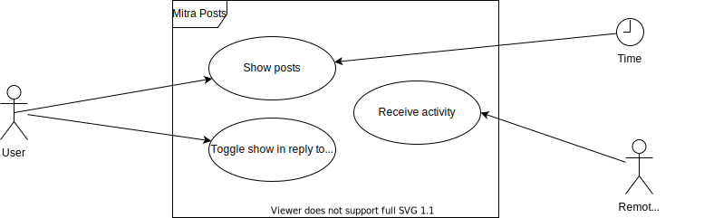

# System definition

## System context

## Actors

### User

The user is a natural person who wants to know what's going on in the world.

### Remote ActivityPub Server

The server is the remote ActivityPub server. This can be your own server or a different one.

# Functional requirements

## Use Case

### General exception scenarios
We have the following general exception scenarios applying to all use cases below:

- The server endpoint responds with an HTTP status code >399

### Template

| Section             | Content |
| ------------------- | ------- |
| Identifier          | -       |
| Name                | -       |
| Author              | -       |
| Priority            | -       |
| Criticality         | -       |
| Origin              | -       |
| Responsibility      | -       |
| Description         | -       |
| Triggering Event    | -       |
| Actor               | -       |
| Precondition        | -       |
| Postcondition       | -       |
| Exception scenarios | -       |
| Quality             | -       |

### User Case

| Section             | Content                                                                                   |
|---------------------| ----------------------------------------------------------------------------------------- |
| Identifier          | UC-01                                                                                     |
| Name                | Registration                                                                              |
| Author              | Pascal, Franco                                                                            |
| Priority            | High importance for system success. Technological risk low                                |
| Criticality         | High                                                                                      |
| Responsibility      | Pascal, Franco                                                                            |
| Description         | The user registers on the Mitra site with his email, preferred username and password.     |
| Triggering event    | Click on the registration button.                                                         |
| Actor               | User                                                                                      |
| Precondition        | Email or preferred username is not registered.                                            |
| Exception scenarios | <ol><li>Email or preferred username already exists.</li><li>The repeating password does not match.</li></ol> |

| Section             | Content                                                                          |
| ------------------- | -------------------------------------------------------------------------------- |
| Identifier          | UC-02                                                                            |
| Name                | Login                                                                            |
| Author              | Pascal, Franco                                                                   |
| Priority            | High importance for system success. Technological risk low                       |
| Criticality         | High                                                                             |
| Responsibility      | Pascal, Franco                                                                   |
| Description         | The user sign in with their preferred username and password on the login page.   |
| Triggering event    | User calls up the mitra page and lands on the login page if not logged in yet.   |
| Actor               | User                                                                             |
| Precondition        | User has registered and knows their credentials.                                 |
| Exception scenarios | <ol><li>Credentials are not correct.</li></ol>                                   |

| Section          | Content                                                      |
| ---------------- | ------------------------------------------------------------ |
| Identifier       | UC-03                                                        |
| Name             | Logout                                                       |
| Author           | Pascal, Franco                                               |
| Priority         | Middle importance for system success. Technological risk low |
| Criticality      | Middle                                                       |
| Responsibility   | Pascal, Franco                                               |
| Description      | The user gets logged out of the Mitra page.                  |
| Triggering event | Click on the logout button.                                  |
| Actor            | User                                                         |
| Precondition     | <ol><li>The user is logged in.</li></ol>                     |

| Section             | Content                                                         |
| ------------------- | --------------------------------------------------------------- |
| Identifier          | UC-04                                                           |
| Name                | Edit User                                                       |
| Author              | Pascal, Franco                                                  |
| Priority            | Middle importance for system success. Technological risk low    |
| Criticality         | Middle                                                          |
| Responsibility      | Pascal, Franco                                                  |
| Description         | The user can edit their personal data.                          |
| Triggering event    | User clicks on the settings link/icon.                          |
| Actor               | User                                                            |
| Precondition        | User is logged in.                                              |
| Exception scenarios | <ol><li>The repeating password does not match.</li><li>E-Mail address is invalid.</li><li>E-Mail is already registered.</li><li>Current password is missing/wrong.</li></ol> |

| Section             | Content                                                      |
| ------------------- | ------------------------------------------------------------ |
| Identifier          | UC-05                                                        |
| Name                | Delete User                                                  |
| Author              | Pascal, Franco                                               |
| Priority            | Low importance for system success. Technological risk middle |
| Criticality         | Low                                                          |
| Responsibility      | Pascal, Franco                                               |
| Description         | A user can delete their account.                             |
| Triggering event    | Click the delete button on the settings page.                |
| Actor               | User                                                         |
| Precondition        | <ul><li>The user must confirm that the account will be deleted.</li><li>The user must provide the current password.</li></ul>      |
| Exception scenarios | <ol><li>The current password is incorrect.</li></ol>         |

| Section             | Content                                                                                        |
| ------------------- | ---------------------------------------------------------------------------------------------- |
| Identifier          | UC-06                                                                                          |
| Name                | Forgot Password                                                                                |
| Author              | Pascal, Franco                                                                                 |
| Priority            | Low importance for system success. Technological risk middle                                   |
| Criticality         | Low                                                                                            |
| Responsibility      | Pascal, Franco                                                                                 |
| Description         | If a user no longer knows their password, they can reset the password by entering their email. |
| Triggering event    | Click the Forgot Password Link.                                                                |
| Actor               | User                                                                                           |
| Postcondition       | E-Mail exists.                                                                                 |
| Exception scenarios | <ol><li>The email does not exist.</li></ol>                                                    |

| Section          | Content                                                                                                                            |
| ---------------- | ---------------------------------------------------------------------------------------------------------------------------------- |
| Identifier       | UC-07                                                                                                                              |
| Name             | Search User                                                                                                                        |
| Author           | Pascal, Franco                                                                                                                     |
| Priority         | High importance for system success. Technological risk high                                                                        |
| Criticality      | Middle                                                                                                                             |
| Responsibility   | Pascal, Franco                                                                                                                     |
| Description      | The user enters the desired webfinger id in the search field. as a result he gets a user with his information where he can follow. |
| Triggering event | Click the search button.                                                                                                           |
| Actor            | User                                                                                                                               |
| Precondition     | User is logged in.                                                                                                                 |

### Posts Case

| Section          | Content                                                                                                       |
| ---------------- | ------------------------------------------------------------------------------------------------------------- |
| Identifier       | UC-08                                                                                                         |
| Name             | Show posts                                                                                                    |
| Author           | Pascal, Franco                                                                                                |
| Priority         | High importance for system success. Technological risk high                                                   |
| Criticality      | High                                                                                                          |
| Responsibility   | Pascal, Franco                                                                                                |
| Description      | The post is displayed to the user from the users they're following.                                           |
| Triggering event | <ul><li>Login redirects to the home page with the posts.</li><li>Home link is clicked.</li><li>Refresh icon is clicked.</li><li>Pulling based on intervall.</li></ul> |
| Actor            | User                                                                                                          |
| Precondition     | User is logged in.                                                                                            |

| Section          | Content                                                                       |
| ---------------- | ----------------------------------------------------------------------------- |
| Identifier       | UC-09                                                                         |
| Name             | Toggle show "in reply to" post                                                |
| Author           | Pascal, Franco                                                                |
| Priority         | Low importance for system success. Technological risk high                    |
| Criticality      | Low                                                                           |
| Responsibility   | Pascal, Franco                                                                |
| Description      | The post to which the displayed post was replied to should also be displayed. |
| Triggering event | The "in reply to" post should be made visible and invisible again on click.   |
| Actor            | User                                                                          |
| Precondition     | <ul><li>The user is logged in.</li><li>An "in reply to" post is available.</li></ul> |

| Section          | Content                                                                                  |
| ---------------- | ---------------------------------------------------------------------------------------- |
| Identifier       | UC-10                                                                                    |
| Name             | Receive activity                                                                         |
| Author           | Pascal, Franco                                                                           |
| Priority         | High importance for system success. Technological risk high                              |
| Criticality      | High                                                                                     |
| Responsibility   | Pascal, Franco                                                                           |
| Description      | The server receives activities from users on other servers which the mitra user follows. |
| Triggering event | Write operation on user's inbox.                                                         |
| Actor            | Remote ActivityPub Server                                                                |
| Precondition     | User exists.                                                                             |

### Follow Case

| Section          | Content                                                         |
| ---------------- | --------------------------------------------------------------- |
| Identifier       | UC-11                                                           |
| Name             | Follow actor                                                    |
| Author           | Pascal, Franco                                                  |
| Priority         | High importance for system success. Technological risk high     |
| Criticality      | High                                                          |
| Responsibility   | Pascal, Franco                                                  |
| Description      | The user can follow another user.                               |
| Triggering Event | Click the follow button of the desired user.                    |
| Actor            | User                                                            |
| Precondition     | User is logged in.                                              |

| Section          | Content                                                         |
| ---------------- | --------------------------------------------------------------- |
| Identifier       | UC-12                                                           |
| Name             | Unfollow actor                                                  |
| Author           | Pascal, Franco                                                  |
| Priority         | Middle importance for system success. Technological risk high   |
| Criticality      | Middle                                                          |
| Responsibility   | Pascal, Franco                                                  |
| Description      | The user no longer wants to follow another user.                |
| Triggering Event | Click the unfollow button of the desired user.                  |
| Actor            | User                                                            |
| Precondition     | User is logged in.                                              |

## Conditions

### Naming Condition

## Data structures of the system interfaces

The data structures coming in and going out of the system are described in the following standards:

- [ActivityStreams](https://www.w3.org/ns/activitystreams)
- [ActivityPub](https://www.w3.org/TR/activitypub/)

# Non-functional requirements

## Quality requirements

### Availability

- The system must be accessible in 99% of the uptime of the underlying infrastructure.

### Reliability

- The correct account is loaded when you log in
- The system should display all posts that the user is following
- The system should display the correct post when filtering for users
- The system should add the right user to the following list

### Performance

- The response times should be less than 0.5 seconds. Where the risk is given for slower responses due to remote server calls an adequate caching mechanism should be put in place.

### Security

- User's data is protected by credentials
- User's can only access and modify their own data

### Usability

- The user should be able to use the application without training

### Changeability

- Requirements must be evolutionary
- Benchmarked against the baseline requirements

## Boundary conditions

### Procedure

- [Kanban (Agile)](https://www.atlassian.com/agile/kanban)

### Standards

- [ActivityPub](https://www.w3.org/TR/activitypub/)
- [ActivityStreams](https://www.w3.org/ns/activitystreams)
