# UX

## Wireframe

### Login

### Sign Up

### Home

#### First Sketch

#### Second Sketch

#### Final Sketch

### Post

### View post with filter from following actors

The first draft went in the direction that the UI could show or hide the posts by actor. However, there can be problems with showing mail if there is no post in the first page of the post collection and ui fetches posts until the content is filled.
So it was decided that a filter can be added in the backend and thus only the posts come from this filter

### Find User Dialog

### Author

### Settings

#### Profile

#### Followers-Following

